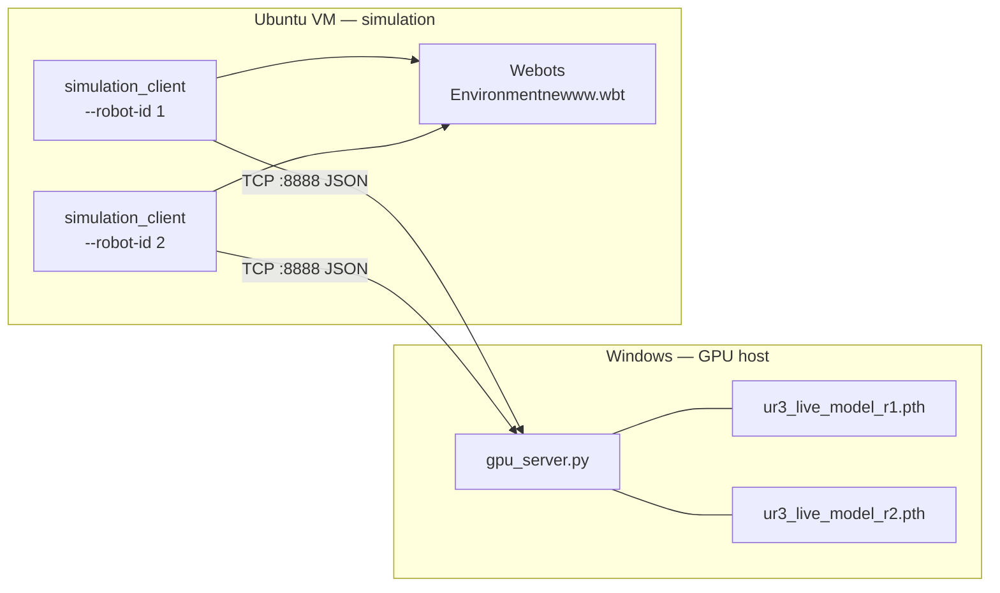

# VR-DT-DRL

**Vision-based UR3e grasping with a Webots digital twin, behavior cloning, and optional real-robot deployment.**

Developed by [Aqlanlab](LICENSE). The stack splits **inference and training** (Windows GPU host) from **simulation and robot control** (Ubuntu VM), connected over TCP. Supports **dual UR3e arms** with separate RGB-D cameras and per-robot models.

---

## Overview

| Layer | Role | Location |
|-------|------|----------|
| **Brain** | CNN inference, behavior-cloning buffers, checkpoint saves | `host_gpu_system/` (Windows) |
| **Body** | Webots sim, ROS, cameras, arm control, curriculum | `vm_simulation_system/` (Ubuntu 18.04 VM) |
| **World** | Dual-robot scene with RealSense-style cameras | `Environmentnewww.wbt` |

The AI watches **RGB-D** (color + depth), predicts a **6-DOF grasp pose**, and executes pick-and-lift episodes. Training uses **imitation learning**: a geometric **teacher** in simulation generates demos; a **MobileNetV2** CNN learns to copy them. An optional **curriculum** increases spawn difficulty as success rate improves.



---

## Repository structure

```
VR-DT-DRL/
├── host_gpu_system/           # Windows GPU server
│   ├── config/network_config.yaml
│   ├── models/                # Trained checkpoints (r1, r2)
│   ├── requirements.txt
│   └── src/
│       ├── gpu_server.py      # Main entry — inference + BC training
│       └── enhanced_neural_network.py
├── vm_simulation_system/      # Ubuntu VM client + Webots assets
│   ├── config/                  # Network, robot, camera, Webots
│   ├── src/
│   │   ├── simulation_client.py # Main entry — episodes + TCP client
│   │   ├── webots_bridge.py
│   │   ├── enhanced_robot_controller.py
│   │   └── Touch.py             # PyQt launcher (optional)
│   ├── Webots/                  # Protos, controllers, world zip
│   └── setup.sh                 # VM dependency installer
└── LICENSE
```

---

## Requirements

### Windows (GPU host)

- Python 3.8+
- NVIDIA GPU with CUDA (recommended)
- Dependencies: see [`host_gpu_system/requirements.txt`](host_gpu_system/requirements.txt) (PyTorch 2.0+, OpenCV, PyYAML, etc.)

### Ubuntu VM (simulation body)

- **Ubuntu 18.04**
- **ROS Melodic**
- **Webots** (R2023a recommended; installed to `/opt/webots`)
- Python 3 + OpenCV, NumPy, PyYAML

Run the VM installer:

```bash
cd vm_simulation_system
chmod +x setup.sh
./setup.sh
```

Copy the simulation package into your catkin workspace as documented in `setup.sh` (typically `~/catkin_ws/src/vm_simulation_system/`).

### VMware networking (default)

| Machine | IP | Port |
|---------|-----|------|
| Windows host (brain) | `192.168.241.1` | `8888` |
| Ubuntu VM (body) | `192.168.241.128` | — |

Edit [`host_gpu_system/config/network_config.yaml`](host_gpu_system/config/network_config.yaml) and [`vm_simulation_system/config/network_config.yaml`](vm_simulation_system/config/network_config.yaml) if your subnet differs.

---

## Quick start

### 1. Windows — start the GPU server

```powershell
cd host_gpu_system
python -m venv venv
.\venv\Scripts\Activate.ps1
pip install -r requirements.txt

python src\gpu_server.py
```

Models load automatically from `host_gpu_system/models/`:

- `ur3_live_model_r1.pth` — Robot 1
- `ur3_live_model_r2.pth` — Robot 2

Optional: override Robot 1 weights only:

```powershell
python src\gpu_server.py --model "path\to\ur3_live_model_r1.pth"
```

Robot 2 always loads `models/ur3_live_model_r2.pth` on the same startup. **One server process serves both robots.**

Set `_barrier_num_robots` in `gpu_server.py` (line ~114) to match your client count:

| Setup | Value |
|-------|-------|
| One robot | `1` |
| Two robots | `2` |

### 2. Ubuntu VM — sync code (after Windows edits)

The VM runs a copy under `~/catkin_ws/`. Sync via VMware shared folders:

```bash
sudo vmhgfs-fuse .host:/ /mnt/hgfs -o allow_other   # after VM reboot

cp /mnt/hgfs/VR-DT-DRL/vm_simulation_system/src/*.py \
   ~/catkin_ws/src/vm_simulation_system/src/
```

### 3. Ubuntu VM — run simulation

**Terminal 1** (optional):

```bash
roscore
```

**Webots:** Open `Environmentnewww.wbt` from your catkin workspace, press **Play**.

**Terminal 2 — Robot 1:**

```bash
cd ~/catkin_ws/src/vm_simulation_system
python3 src/simulation_client.py --mode inference --phase 4 --robot-id 1
```

**Terminal 3 — Robot 2** (dual-robot world):

```bash
cd ~/catkin_ws/src/vm_simulation_system
python3 src/simulation_client.py --mode inference --phase 4 --robot-id 2
```

### Expected startup logs

**Robot 1:** `WEBOTS_ROBOT_NAME=ur3e_robot` · `motors bound: 6/6` · `Fresh camera frame`

**Robot 2:** `WEBOTS_ROBOT_NAME=ur3e_robot2` · `R2 RGB-D devices: ready` · AI predictions

**GPU server:** two `Loaded weights` lines · `BC Server listening on 0.0.0.0:8888`

---

## Dual-robot reference

| | Robot 1 | Robot 2 |
|--|---------|---------|
| Webots node | `ur3e_robot` | `ur3e_robot2` |
| RGB camera | `realsense_color` | `realsense_color2` |
| Depth camera | `realsense_range` | `realsense_range2` |
| Target block | `TARGET_OBJECT` | `TARGET_OBJECT2` |
| Model file | `ur3_live_model_r1.pth` | `ur3_live_model_r2.pth` |
| Episode log (runtime) | `data/episode_log_r1.csv` | `data/episode_log_r2.csv` |

Each arm needs its **own** `simulation_client.py` process with matching `--robot-id`. Do not run one client for both arms.

---

## Modes

### Inference (deploy trained model)

```bash
python3 src/simulation_client.py --mode inference --phase 4 --robot-id 1
```

Inference sub-modes (one at a time):

| Flag | Effect |
|------|--------|
| `--phase N` | Lock curriculum spawn to phase 0–4 |
| `--cycle N` | Cycle all phases, N episodes each |
| `--free` | Manual object placement; AI grasps wherever you put it |

### Training (simulation — behavior cloning)

```bash
python3 src/simulation_client.py --mode training --robot-id 1
```

Teacher demos (`explore`) and student policy (`exploit`) run in Webots; the GPU server buffers demos and runs BC updates. Checkpoints save to `host_gpu_system/models/` every 100 steps.

### Real robot

```bash
python3 src/simulation_client.py --real --robot-id 1
# or with ROS camera topics (e.g. Raspberry Pi):
python3 src/simulation_client.py --ros-camera --robot-id 1
```

`--real` forces inference mode. Requires ROS, RealSense (`pyrealsense2`), and Robotiq gripper packages on the real cell.

---

## How learning works

1. **Teacher (`explore`)** — Hand-designed grasp from object pose in Webots.
2. **Student (`exploit`)** — CNN predicts grasp from RGB-D.
3. **Behavior cloning** — GPU server stores `(image, pose, reward)` tuples and trains pose regression on successful / near-miss episodes.
4. **Curriculum** — Spawn radius increases when AI success rate crosses phase thresholds.
5. **Domain randomization** — Textures, lighting, and colors vary each episode to narrow the sim-to-real gap.

Message types over TCP (length-prefixed JSON):

- `camera_data` → grasp prediction
- `training_data` → demo buffer + async BC step
- `episode_end` → multi-robot barrier sync

---

## Configuration

| File | Purpose |
|------|---------|
| `host_gpu_system/config/network_config.yaml` | Host bind address and port |
| `vm_simulation_system/config/network_config.yaml` | VM → host connection |
| `vm_simulation_system/config/robot_config.yaml` | UR3e joints, workspace, gripper |
| `vm_simulation_system/config/camera_config.yaml` | Resolution, ROS topics |
| `vm_simulation_system/config/webots_config.yaml` | World file, timestep |

---

## Data and logging

Each robot appends to a CSV after every episode (written under `data/` relative to the client working directory on the VM):

- `data/episode_log_r1.csv`
- `data/episode_log_r2.csv`

Columns include timestamp, spawn pose, AI pose, success, reward, lift height, and curriculum phase. Debug camera snapshots:

- `~/catkin_ws/src/vm_simulation_system/data/latest_camera_view_r{1|2}.jpg`

---

## Troubleshooting

| Symptom | Likely cause | Fix |
|---------|--------------|-----|
| Hang between episodes | Barrier mismatch | Set `_barrier_num_robots` to 1 or 2 |
| `realsense_color2` warnings on R1 | Wrong client / stale code | `--robot-id 1`; sync `webots_bridge.py` |
| `Node has no attribute getDevice` | Old controller code | Sync `enhanced_robot_controller.py` |
| Robot 2 random / bad grasps | Missing r2 model | Add `ur3_live_model_r2.pth` to `models/` |
| Stale camera image | Buffer not flushed | Sync `simulation_client.py`; keep Webots stepping |
| VM changes not applied | Forgot hgfs copy | Copy from `/mnt/hgfs/VR-DT-DRL/...` |
| Can't reach GPU server | Network / firewall | Verify `192.168.241.1:8888` and Windows firewall |

---

## License

MIT License — Copyright (c) 2026 Aqlanlab. See [LICENSE](LICENSE).
