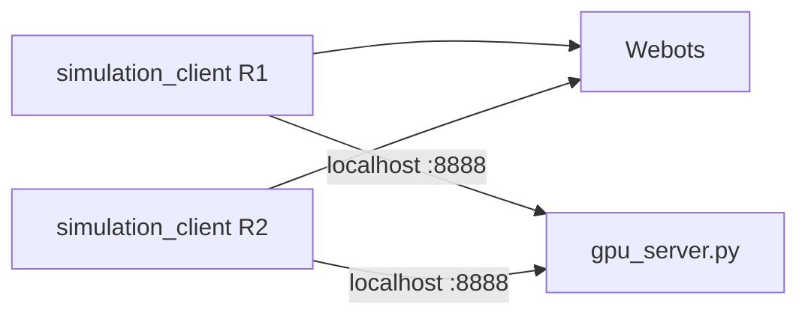

# VR-DT-DRL

Vision-based **UR3e grasping** with a **Webots digital twin** and a **GPU inference server** on Windows.

MIT License · [Aqlanlab](LICENSE)

---

## What runs where (Windows setup)

Everything runs on **one Windows PC**:

| Component | What it does |
|-----------|----------------|
| **Webots** | Simulation world (`updated_world/worlds/Environmentnewww.wbt`) |
| **`gpu_server.py`** | CNN inference on your NVIDIA GPU |
| **`simulation_client.py`** | Robot control, cameras, episodes (one process per arm) |

Clients talk to the GPU server over **`127.0.0.1:8888`**.



---

## One-time setup

### 1. Install software

| Tool | Version / notes |
|------|-----------------|
| **Python** | **3.9** (required for Webots 2021a controller API) |
| **Webots** | **2021a** ([download](https://github.com/cyberbotics/webots/releases)) |
| **NVIDIA driver + CUDA** | For GPU inference (PyTorch cu118/cu121) |

Default Webots install path on Windows:

`%LOCALAPPDATA%\Programs\Webots`

### 2. Webots world assets

The Webots project lives in **`updated_world/`** at the repo root (create that folder and put the contents of **`Webots.rar`** from Box inside — see [Files on Box](#files-on-box-not-on-github)). Open in Webots:

- `updated_world/worlds/Environmentnewww.wbt`
- `updated_world/protos/` (meshes, textures, UR3e protos)

If you copy a fresh tree from Box and paths still reference Linux (`/home/seth/...`), fix once:

```powershell
cd VR-DT-DRL
python vm_simulation_system\Webots\scripts\fix_vm_paths_for_windows.py
```

The script defaults to `updated_world/`. Domain-randomization texture JPGs are also read from `vm_simulation_system/Webots/protos/textures/Dataset/` when the client runs.

### 3. Python environment (GPU + sim client)

```powershell
cd host_gpu_system
python -m venv venv
.\venv\Scripts\Activate.ps1
pip install -r requirements.txt --extra-index-url https://download.pytorch.org/whl/cu121
```

Confirm CUDA:

```powershell
python -c "import torch; print(torch.cuda.is_available())"
```

`openpyxl` is included in `requirements.txt` (episode Excel logs).

### 4. Network config (localhost)

In `vm_simulation_system/config/network_config.yaml`:

```yaml
network:
  host_ip: "127.0.0.1"
  host_port: 8888
```

Leave `host_gpu_system/config/network_config.yaml` as `host_ip: "0.0.0.0"`.

### 5. Models

Place trained weights in `host_gpu_system/models/`:

- `ur3_live_model_r1.pth`
- `ur3_live_model_r2.pth` (dual-arm world)

### 6. GPU server firewall (once)

```powershell
netsh advfirewall firewall add rule name="UR3e GPU Server" dir=in action=allow protocol=TCP localport=8888
```

### 7. Dual-arm barrier (if using one or two robots)

In `host_gpu_system/src/gpu_server.py` (~line 114), set `_barrier_num_robots`:

| Arms running | Value |
|--------------|-------|
| Robot 1 only | `1` |
| Robot 1 + 2 | `2` |

With **two** clients, the GPU server uses setup barriers: Robot 1 sets up the world first, Robot 2 second, then **both** wait until setup is complete before either resumes grasping.

---

## Curriculum phases

Grasp **training** progresses through six spawn phases (0–5). Each phase places the block at increasing distance from the platform centre. The client advances automatically when enough AI grasp attempts hit a success-rate target (training mode only).

| Phase | Spawn region |
|-------|----------------|
| **0** | Centre only (fixed) |
| **1** | 0.5–1.5 cm radius |
| **2** | 1.5–3.5 cm radius |
| **3** | 3.5–7.0 cm radius |
| **4** | 7.0–11.5 cm outer ring |
| **5** | Anywhere on usable platform (uniform) |

Training and inference use the same spawn rules for each phase number. **`--phase N`** locks inference to that phase; with no flag, spawns follow the saved phase in `config/curriculum_state.json`.

**Inference** (`--mode inference`) does not advance phases. Pick how spawns behave:

| Flag | Behavior |
|------|----------|
| `--phase N` | Lock spawns to phase **0–5** (same regions as the table above) |
| *(no extra flag)* | Use saved phase from `config/curriculum_state.json` |
| `--cycle N` | Rotate through phases (default **0→5**); add **`--cycle-from`** / **`--cycle-to`** to limit the range |
| `--cycle-from N` / `--cycle-to M` | With **`--cycle`**, only rotate phases **N…M** (e.g. **1–4**) |
| `--free` | No auto-spawn; place the block manually in Webots |

Episode logs for `--phase N` go to `data/episode_log_r1_phaseN.xlsx`.

---

## Real UR3e arm (physical hardware)

Webots is not required. Full bring-up, startup commands, and troubleshooting for **Ubuntu VM + Windows GPU** (network, UR driver, pendant, gripper, D455, inference client) are in **[docs/physical_arms.md](docs/physical_arms.md)**.

---

## Run simulation (every session)

**Order matters:** GPU server → Webots **Play** → client(s).

**Stopping a running command:** In PowerShell, press **Ctrl+Pause** to interrupt `gpu_server.py`, `simulation_client.py`, or other long-running processes. On many laptops the **Pause** key is only available via **Fn** — use **Ctrl+Fn+Pause** instead.

### Terminal 1 — GPU server

```powershell
cd host_gpu_system
.\venv\Scripts\Activate.ps1
python src\gpu_server.py
```

Wait for: `BC Server listening on 0.0.0.0:8888`

### Webots

1. Open `updated_world\worlds\Environmentnewww.wbt`
2. **Reset Simulation**
3. Press **Play**

### Terminal 2 — Robot 1

```powershell
cd host_gpu_system
.\venv\Scripts\Activate.ps1
cd ..\vm_simulation_system

$env:WEBOTS_HOME = "$env:LOCALAPPDATA\Programs\Webots"
$env:WEBOTS_ROBOT_NAME = "ur3e_robot"

python src\simulation_client.py --mode inference --cycle 20 --cycle-from 1 --cycle-to 4 --robot-id 1
```

This rotates **phases 1→2→3→4→1…**, **20 episodes per phase**. For a single phase, use **`--phase N`** (e.g. **`--phase 4`**). **`--phase 5`** is full-board spawns (hardest; use only when you intend to stress-test edges). See [Curriculum phases](#curriculum-phases).

### Terminal 3 — Robot 2 (optional, dual-arm world)

```powershell
cd host_gpu_system
.\venv\Scripts\Activate.ps1
cd ..\vm_simulation_system

$env:WEBOTS_HOME = "$env:LOCALAPPDATA\Programs\Webots"
$env:WEBOTS_ROBOT_NAME = "ur3e_robot2"

python src\simulation_client.py --mode inference --cycle 20 --cycle-from 1 --cycle-to 4 --robot-id 2
```

### Good startup signs

- `[WebotsBridge] Connected to robot 'ur3e_robot'`
- `Webots motors bound: 6/6`
- `Connected to GPU server at 127.0.0.1:8888`
- `[AI PREDICTION R1]` when an episode runs

---

## Targeted BC fine-tuning (70% weak / 30% normal)

Fine-tune existing BC checkpoints on weak spawn regions while mixing in full-grid demos. Standard `--mode training` is unchanged.

Config: [`host_gpu_system/config/fine_tune_config.yaml`](host_gpu_system/config/fine_tune_config.yaml)

| Setting | Default | Purpose |
|---------|---------|---------|
| `sampling.weak_ratio` | `0.7` | Fraction of each training batch from weak-region buffer |
| `sampling.normal_ratio` | `0.3` | Fraction from full-grid buffer |
| `training.learning_rate` | `1e-4` | Lower than original BC (`5e-4`) |
| `collection.weak_spawn_probability` | `0.7` | Episode spawn mix (weak cell vs full grid) |

**Weak regions** (inference-style phase bands + quadrant):

- **R1:** phase 4 band, quadrant IV
- **R2:** phase 3 QIII/QIV; phase 4 QI/QIII/QIV

### Terminal 1 — GPU server (fine-tune)

```powershell
cd host_gpu_system
.\venv\Scripts\Activate.ps1
python src\gpu_server.py --fine-tune
```

On first run, loads base weights from `models/ur3_live_model_r1.pth` / `ur3_live_model_r2.pth`. If you stop and restart `--fine-tune`, it automatically resumes from `models/R1_BC_targeted_70weak_30normal.pth` / `R2_BC_targeted_70weak_30normal.pth` when those files exist (every 100 training steps). Live base checkpoints are never overwritten. Explicit `--model` / `--model-r2` paths always take precedence.

### Terminal 2 — Robot 1 fine-tune client

```powershell
cd vm_simulation_system
python src\simulation_client.py --mode fine_tune --robot-id 1
```

Episode logs: `data/episode_log_r1_fine_tune.xlsx`

### Evaluate after fine-tuning

1. Start GPU server with the fine-tuned weights:

```powershell
python host_gpu_system\src\gpu_server.py --model host_gpu_system\models\R1_BC_targeted_70weak_30normal.pth
```

2. Run full-grid inference:

```powershell
python vm_simulation_system\src\simulation_client.py --mode inference --phase 5 --robot-id 1
```

3. Generate spatial report (success rates, failure taxonomy, quadrant breakdown):

```powershell
python analysis\spawn_spatial_report.py data\episode_log_r1_phase5.xlsx --spawn-phase 5 -o "data\episode report"
```

Outputs PDF under `data/episode report/`. See `data/README.md` for more options.

---

## Locator + geometry grasp (Phase 1)

Opt-in pipeline: train CNN **`aux_position`** on sim object `(X,Z)` labels, then at inference convert predicted position through shared teacher geometry into a grasp pose. BC `pose_6dof`, fine-tune, and residual RL paths are unchanged unless you pass the flags below.

Config: [`host_gpu_system/config/locator_train_config.yaml`](host_gpu_system/config/locator_train_config.yaml)

| Setting | Default | Purpose |
|---------|---------|---------|
| `sampling.weak_ratio` | `0.7` | Training batch mix (weak vs normal buffer) |
| `training.learning_rate` | `1e-4` | Locator-only aux loss |
| `collection.weak_spawn_probability` | `0.7` | Episode spawn mix (same weak regions as fine-tune) |
| `checkpoints.save_r1` / `save_r2` | `R1_locator.pth` / `R2_locator.pth` | Per-arm locator checkpoints |

More detail: [`docs/locator_geo_grasp.md`](docs/locator_geo_grasp.md)

### Terminal 1 — GPU server (locator training)

```powershell
cd host_gpu_system
.\venv\Scripts\Activate.ps1
python src\gpu_server.py --locator-train
```

On first run, loads base weights from `models/ur3_live_model_r1.pth` / `ur3_live_model_r2.pth`. Restarts resume from `models/R1_locator.pth` / `R2_locator.pth` when present.

**Collection:** spawn → camera snapshot → GPU demo (no arm pick). Labels = spawn X/Z. Look for `[LOCATOR-COLLECT R1]` and `grasp=locator_collect` in client logs; GPU shows `LOC Step` / `Aux:` loss. Restart train after updating collection code (do not mix old buffer labels).

### Terminal 2 — Robot 1 locator client

```powershell
cd vm_simulation_system
python src\simulation_client.py --mode locator_train --robot-id 1
```

Episode logs: `data/episode_log_r1_locator_train.xlsx` (labels + per-demo CNN error). GPU step log: `data/locator_train_steps_r1.csv` (aux loss curve). Report: `python analysis/locator_train_report.py data/episode_log_r1_locator_train.xlsx`

### Evaluate geo-grasp (phase 4 baseline)

1. Start GPU server with locator weights and geo-grasp routing:

```powershell
python host_gpu_system\src\gpu_server.py --geo-grasp
```

Weights load from `host_gpu_system\models\R1_locator.pth` and `R2_locator.pth` by default. Override with `--model models\R1_locator.pth --model-r2 models\R2_locator.pth` (paths relative to `host_gpu_system\`, not `host_gpu_system\host_gpu_system\`).

2. Run locked-phase inference:

```powershell
python vm_simulation_system\src\simulation_client.py --mode inference --use-geo-grasp --phase 4 --robot-id 1
```

Diagnostic (no workspace clip, like teacher explore):

```powershell
python vm_simulation_system\src\simulation_client.py --mode inference --use-geo-grasp --phase 4 --robot-id 2 --no-workspace-clamp
```

Logs include `pred_obj_x_m`, `pred_obj_z_m`, and `locator_err_m` (predicted vs spawn center). Compare success rate and `clamp_limited` against BC fine-tune on the same phase:

```powershell
python analysis\spawn_spatial_report.py data\episode_log_r1_phase4.xlsx --spawn-phase 4 -o "data\episode report"
```

**Phase 1 targets:** R1 phase 4 success above BC ~62%; R2 phase 4 success up and/or `clamp_limited` down vs BC ~28% / ~60%; median `locator_err_m` below ~3 cm on failures.

---

## Residual RL fine-tune (TD3, BC frozen)

Opt-in RL on top of BC checkpoints. BC training/inference paths are unchanged unless you pass RL flags.

**History / failed attempts:** [`docs/rl_residual_training_chronicle.md`](docs/rl_residual_training_chronicle.md) — chronology of every RL run, reward version, bugs, and collapse pattern.

Config: [`host_gpu_system/config/rl_train_config.yaml`](host_gpu_system/config/rl_train_config.yaml) (per-robot reward weights and max residual Δ).

**Start from the repo root** (adjust if your clone lives elsewhere):

```powershell
cd C:\Users\m0ha0001\Desktop\VR-DT-DRL
```

### Terminal 1 — GPU server (RL train)

```powershell
cd C:\Users\m0ha0001\Desktop\VR-DT-DRL\host_gpu_system
.\venv\Scripts\Activate.ps1
python src\gpu_server.py --rl-train --model models\ur3_live_model_r1.pth --model-r2 models\ur3_live_model_r2.pth
```

Saves **`models/R1_RL_residual.pth`** / **`R2_RL_residual.pth`** (never overwrites BC weights). If those files are missing, TD3 starts fresh. **Current experiment:** minimal dynamics — `LR=1e-4`, exploration noise anneal, gated `w_align`, skip clamp-limited replay — see [`docs/rl_residual_training_chronicle.md`](docs/rl_residual_training_chronicle.md) §12.

### Terminal 2 — RL train client (R1)

```powershell
cd C:\Users\m0ha0001\Desktop\VR-DT-DRL\host_gpu_system
.\venv\Scripts\Activate.ps1
cd ..\vm_simulation_system

$env:WEBOTS_HOME = "$env:LOCALAPPDATA\Programs\Webots"
$env:WEBOTS_ROBOT_NAME = "ur3e_robot"

python src\simulation_client.py --mode rl_train --robot-id 1
```

### Terminal 3 — RL train client (R2, dual-arm)

```powershell
cd C:\Users\m0ha0001\Desktop\VR-DT-DRL\host_gpu_system
.\venv\Scripts\Activate.ps1
cd ..\vm_simulation_system

$env:WEBOTS_HOME = "$env:LOCALAPPDATA\Programs\Webots"
$env:WEBOTS_ROBOT_NAME = "ur3e_robot2"

python src\simulation_client.py --mode rl_train --robot-id 2
```

Episode logs: `data/episode_log_r1_rl_train.xlsx` / `r2_...` (includes `residual_dx/dz/dyaw`, `lateral_aim_err_m`, etc.).

### Inference with residual

```powershell
cd host_gpu_system
.\venv\Scripts\Activate.ps1
python src\gpu_server.py --rl-residual-r1 models/R1_RL_residual.pth --rl-residual-r2 models/R2_RL_residual.pth
```

```powershell
cd host_gpu_system
.\venv\Scripts\Activate.ps1
cd ..\vm_simulation_system

$env:WEBOTS_HOME = "$env:LOCALAPPDATA\Programs\Webots"
$env:WEBOTS_ROBOT_NAME = "ur3e_robot"

python src\simulation_client.py --mode inference --use-residual --phase 4 --robot-id 1
```

### Evaluate failure mix + reward config

```powershell
cd host_gpu_system
.\venv\Scripts\Activate.ps1
cd ..
python analysis\evaluate_rl_rewards.py data\episode_log_r1_rl_train.xlsx
```

---

## Episode logs

Written under **`VR-DT-DRL/data/`** (repo root), e.g.:

- `data/episode_log_r1.xlsx` (cycle / normal inference)
- `data/episode_log_r1_phase4.xlsx` (when using `--phase 4`)
- `data/episode_log_r1_fine_tune.xlsx` (targeted fine-tune collection)
- `data/episode_log_r1_locator_train.xlsx` (locator supervised collection)
- `data/episode_log_r1_rl_train.xlsx` (residual RL training)

Column **timestamp_local** uses your Windows timezone in 12-hour format.

---

## Troubleshooting

| Problem | Fix |
|---------|-----|
| `Webots not connected` | Webots must be **playing** before starting the client; use **Reset Simulation** then Play |
| `DLL load failed` / wrong python API | Use **Python 3.9** venv; Webots API folder must be `python39`, not `python38` |
| Client exits immediately | Start `gpu_server.py` first; check `host_ip: "127.0.0.1"` in client config |
| Hang between episodes | Match `_barrier_num_robots` to number of running clients (1 or 2) |
| Missing textures / meshes | Ensure `updated_world/protos/` is complete; run path fix script on `updated_world/` |
| `openpyxl` error | `pip install openpyxl` in `host_gpu_system\venv` |

**Connection test** (Webots playing, Robot 1 env set):

```powershell
python vm_simulation_system\Webots\scripts\probe_webots_connection.py
```

Expected: `OK robot=ur3e_robot timestep=16`

---

## Files on Box (not on GitHub)

Clone the repo first, then download these from **Box** and place them as shown.

**`Webots.rar`** on Box contains the **contents** of the Webots project (`worlds/`, `protos/`, etc.) — not a folder named `updated_world/`. After clone:

1. Create `VR-DT-DRL/updated_world/`
2. Extract `Webots.rar` and move everything into that folder (you should see `updated_world/worlds/Environmentnewww.wbt`, `updated_world/protos/`, …)

| Item | Put here |
|------|----------|
| Webots project (from `Webots.rar`) | `VR-DT-DRL/updated_world/` |
| `ur3_live_model_r1.pth` | `host_gpu_system/models/` |
| `ur3_live_model_r2.pth` | `host_gpu_system/models/` (dual-arm only) |

Also copy `updated_world/protos/textures/Dataset/` → `vm_simulation_system/Webots/protos/textures/Dataset/` (domain randomization; sim runs without it, but with colour-only textures).

---

## License

MIT License — Copyright (c) 2026 Aqlanlab. See [LICENSE](LICENSE).
