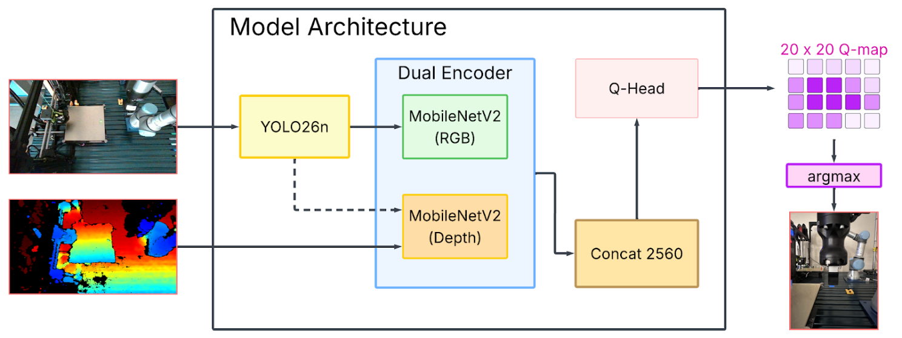
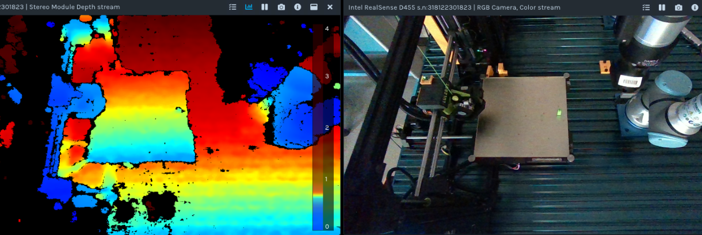
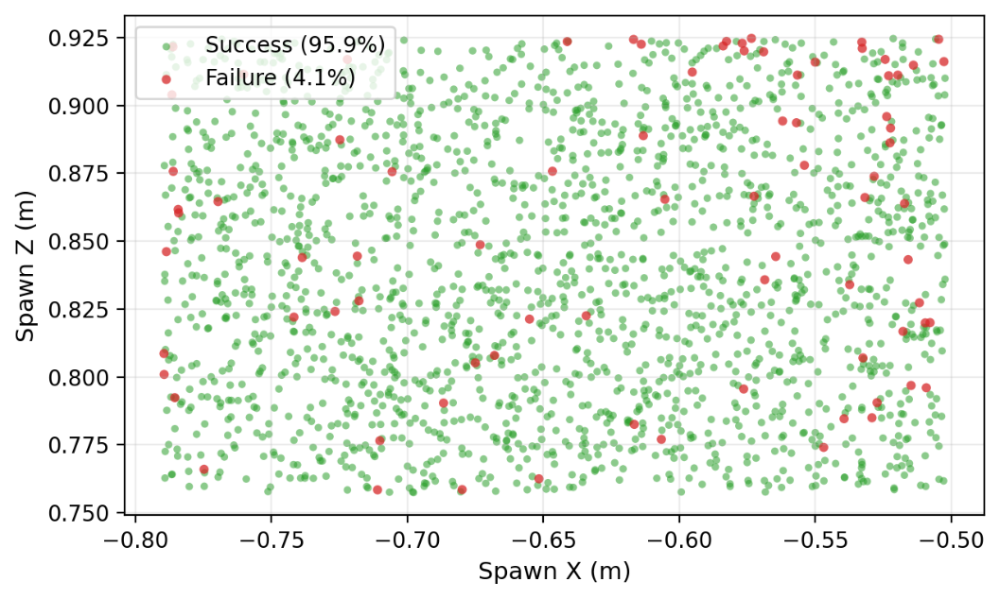
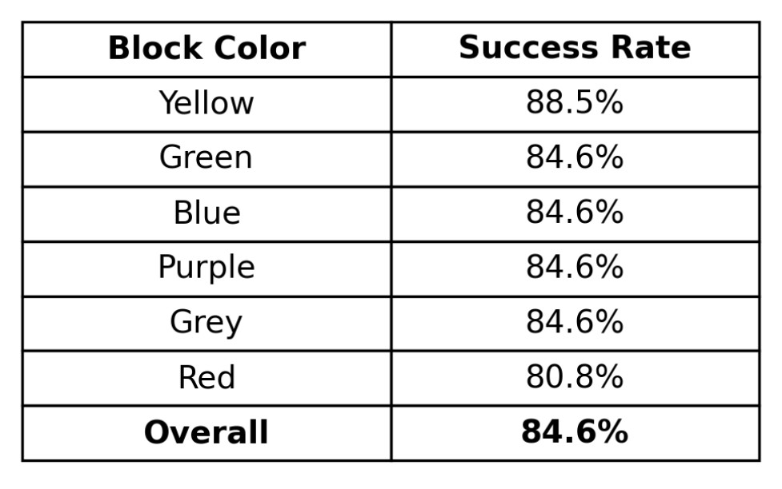
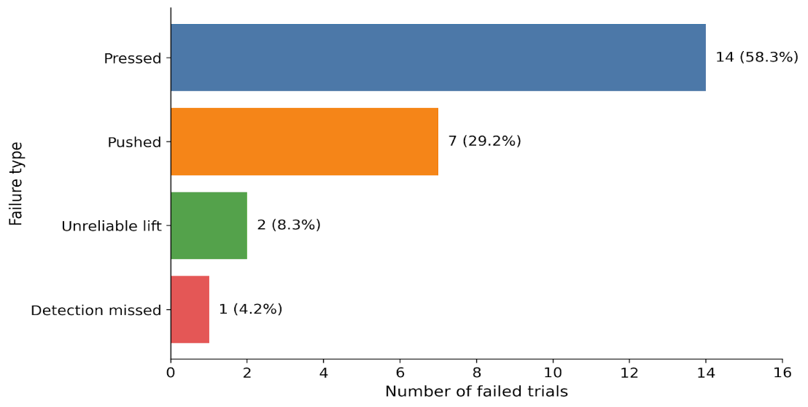

# Vision-Based Sim-to-Real Reinforcement Learning for Cobot Precision Pick-and-Place

---

## 1. Introduction

In advanced manufacturing, collaborative robots (cobots) are increasingly used for assembly, sorting, packaging, and small-part handling. Among these applications, precision pick-and-place is especially challenging because it demands millimeter-level alignment under realistic operating conditions.

However, achieving reliable results under realistic conditions remains difficult and time-consuming, and many systems are validated only in simulation or idealized lab setups. Bridging this **sim-to-real gap**—policies trained in simulation that still work on hardware—is the focus of this work.

---

## 2. Project objectives

**Research question:** Can a cobot reliably lift a small 3D-printed block (about 1.1 cm × 3.3 cm × 1.1 cm) in a realistic environment when trained only in simulation?

Goals:

- Build a matched **Webots** digital twin of the physical cell
- Train a vision-based grasp policy entirely in simulation
- Transfer that policy to a physical **UR3e** without additional fine-tuning

---

## 3. Research methodology

- **Detector:** YOLOv26n trained to localize the block in the board view
- **Grasp policy:** Dual-MobileNetV2 DQN (RGB + depth) with ε-greedy exploration; selects a grasp cell in a local window around the detection
- **Hardware:** UR3e cobot, Intel RealSense D455, LulzBot TAZ Workhorse print bed; oblique camera view is warped to a top-down board image before perception

Training and evaluation use the same perception–control stack in Webots and on the real arm (GPU inference on Windows; ROS on the robot side for hardware runs).

  

<em>Figure 1. Proposed vision-based grasp architecture.</em>

---

## 4. Limitations

- Missing or unreliable depth near bed edges
- Perspective distortion from the oblique D455 mount (not a true overhead camera)

  

<em>Figure 2. Intel RealSense D455 RGB and depth streams.</em>

---

## 5. Results

- **Simulation:** 1,975 episodes
- **Real world:** 156 trials; overall success **84.6%** across block colors (yellow, green, blue, purple, grey, red)

Success varies with block position on the bed. Failures are concentrated in harder regions rather than uniform random misses.

  

<em>Figure 3. Spatial distribution of grasp results (simulation).</em>

  

<em>Table 1. Real-world grasp trial results.</em>

---

## 6. Discussion

Of the failed real-world trials, common modes include pressed grasps, pushes, unreliable lifts, and missed detections. Excluding one especially problematic position raises success to about **91.7%**, which suggests localization and edge sensing—not coarse grasp planning—limit performance in poorly sensed regions.

  

<em>Table 2. Grasp failure taxonomy.</em>

---

## 7. Conclusion

A vision-based policy trained entirely in simulation can transfer to a physical cobot for precision pick-and-place **without additional fine-tuning**.

---

## 8. Future work

- Local vision-language model (VLM) for free-form language-guided block selection
- Extend the pipeline beyond blocks (e.g. toy car parts)

---

## 9. Acknowledgements

Mentorship from Dr. Faisal Aqlan and Jaime Morales. Thanks to Seth Gibbs for assistance with the Webots environment. Supported by the National Science Foundation REU Site in Advanced Manufacturing and Supply Chain.

---

## Setup documentation

| Guide | Contents |
|-------|----------|
| [docs/setup.md](docs/setup.md) | One-time setup: software, world files, Python env, models |
| [docs/simulation.md](docs/simulation.md) | Train and run in Webots |
| [docs/physical_arms.md](docs/physical_arms.md) | Run on the real UR3e arm |

---

## License

MIT License — Copyright (c) 2026 Aqlanlab. See [LICENSE](LICENSE).
