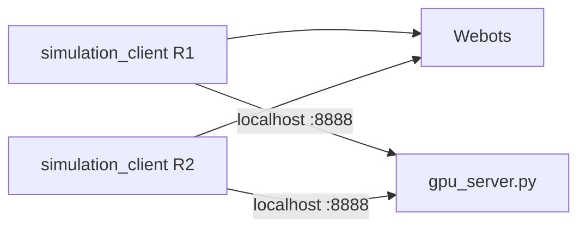

# VR-DT-DRL

Vision-based **UR3e grasping** with a **Webots digital twin** and a **GPU inference server** on Windows.

**Current pipeline:** local-bbox DQN ΓÇö YOLO detects the block, a fixed world window is cropped around the bbox center, and a DQN picks the grasp cell.

MIT License ┬╖ [Aqlanlab](LICENSE)

---

## What runs where (Windows setup)

Everything runs on **one Windows PC**:

| Component | What it does |
|-----------|----------------|
| **Webots** | Simulation world (`updated_world/worlds/Environmentnewww.wbt`) |
| **`gpu_server.py`** | YOLO + local-bbox DQN on your NVIDIA GPU |
| **`simulation_client.py`** | Robot control, cameras, episodes (one process per arm) |

Clients talk to the GPU server over **`127.0.0.1:8888`**.



---

## One-time setup

### 1. Install software

| Tool | Version / notes |
|------|-----------------|
| **Python** | **3.9** (required for Webots 2021a controller API) |
| **Webots** | **2021a** ([download](https://github.com/cyberbotics/webots/releases)) |
| **NVIDIA driver + CUDA** | For GPU inference (PyTorch cu118/cu121) |

Default Webots install path on Windows:

`%LOCALAPPDATA%\Programs\Webots`

### 2. Webots world assets

The Webots project lives in **`updated_world/`** at the repo root (create that folder and put the contents of **`Webots.rar`** from Box inside ΓÇö see [Files on Box](#files-on-box-not-on-github)). Open in Webots:

- `updated_world/worlds/Environmentnewww.wbt`
- `updated_world/protos/` (meshes, textures, UR3e protos)

If you copy a fresh tree from Box and paths still reference Linux (`/home/seth/...`), fix once:

```powershell
cd VR-DT-DRL
python vm_simulation_system\Webots\scripts\fix_vm_paths_for_windows.py
```

The script defaults to `updated_world/`. Domain-randomization texture JPGs are also read from `vm_simulation_system/Webots/protos/textures/Dataset/` when the client runs.

### 3. Python environment (GPU + sim client)

```powershell
cd host_gpu_system
python -m venv venv
.\venv\Scripts\Activate.ps1
pip install -r requirements.txt --extra-index-url https://download.pytorch.org/whl/cu121
```

Confirm CUDA:

```powershell
python -c "import torch; print(torch.cuda.is_available())"
```

`openpyxl` is included in `requirements.txt` (episode Excel logs).

### 4. Network config (localhost)

In `vm_simulation_system/config/network_config.yaml`:

```yaml
network:
  host_ip: "127.0.0.1"
  host_port: 8888
```

Leave `host_gpu_system/config/network_config.yaml` as `host_ip: "0.0.0.0"`.

### 5. Models

Place weights under `host_gpu_system/models/` (gitignored):

| File | Role |
|------|------|
| `block_yolo/weights/best.pt` | YOLO block detector (path set in config) |
| `R1_local_bbox_dqn.pth` | Local-bbox DQN (Robot 1) |
| `R2_local_bbox_dqn.pth` | Local-bbox DQN (Robot 2, dual-arm) |

Paths are configured in [`host_gpu_system/config/local_bbox_dqn_config.yaml`](host_gpu_system/config/local_bbox_dqn_config.yaml).

### 6. GPU server firewall (once)

```powershell
netsh advfirewall firewall add rule name="UR3e GPU Server" dir=in action=allow protocol=TCP localport=8888
```

### 7. Dual-arm barrier (if using one or two robots)

In `host_gpu_system/src/gpu_server.py` (~line 114), set `_barrier_num_robots`:

| Arms running | Value |
|--------------|-------|
| Robot 1 only | `1` |
| Robot 1 + 2 | `2` |

With **two** clients, the GPU server uses setup barriers: Robot 1 sets up the world first, Robot 2 second, then **both** wait until setup is complete before either resumes grasping.

---

## Curriculum phases

Spawns use six phases (0ΓÇô5). Each phase places the block at increasing distance from the platform centre.

| Phase | Spawn region |
|-------|----------------|
| **0** | Centre only (fixed) |
| **1** | 0.5ΓÇô1.5 cm radius |
| **2** | 1.5ΓÇô3.5 cm radius |
| **3** | 3.5ΓÇô7.0 cm radius |
| **4** | 7.0ΓÇô11.5 cm radius band |
| **5** | Anywhere on usable platform (uniform) |

**Inference** (`--mode inference`) does not advance phases. Pick how spawns behave:

| Flag | Behavior |
|------|----------|
| `--phase N` | Lock spawns to phase **0ΓÇô5** |
| *(no extra flag)* | Use saved phase from `config/curriculum_state.json` |
| `--cycle N` | Rotate through phases (default **0→5**); add **`--cycle-from`** / **`--cycle-to`** to limit the range |
| `--free` | No auto-spawn; place the block manually in Webots |

Episode logs for `--phase N` go to `data/episode_log_r1_phaseN.xlsx`.

---

## Real UR3e arm (physical hardware)

Webots is not required. Full bring-up for **Ubuntu VM + Windows GPU** is in **[docs/physical_arms.md](docs/physical_arms.md)**.

---

## Local-bbox DQN

Pipeline: warp board RGB → YOLO block detection → crop a fixed world window around the bbox center → DQN picks a cell in that local grid → analytic grasp from cell world XZ.

Config: [`host_gpu_system/config/local_bbox_dqn_config.yaml`](host_gpu_system/config/local_bbox_dqn_config.yaml)

| Setting | Default | Purpose |
|---------|---------|---------|
| `grid.n` / `grid.window_m` | `20` / `0.02` | Local grid size; 2 cm window (~1 mm/cell) |
| `crop.out_size` | `224` | Crop resolution into the DQN encoder |
| `training.phase` | `rl` | `shaping`, `rl`, or `both` |
| `reward.center_success_m` | `0.002` | Pick vs spawn center ≤ this → success |
| `checkpoints.save_r1` / `save_r2` | `R1_local_bbox_dqn.pth` / `R2_local_bbox_dqn.pth` | Per-arm checkpoints |
| `yolo.weights` | `models/block_yolo/weights/best.pt` | YOLO detector used to center the window |

**Order every session:** GPU server → Webots **Play** → client(s).

**Stopping:** PowerShell **Ctrl+Pause** (often **Ctrl+Fn+Pause** on laptops).

### Train

**Terminal 1 ΓÇö GPU server**

```powershell
cd host_gpu_system
.\venv\Scripts\Activate.ps1
python src\gpu_server.py --local-bbox-dqn-train
```

**Webots:** open `updated_world\worlds\Environmentnewww.wbt` → **Reset Simulation** → **Play**.

**Terminal 2 ΓÇö Robot 1**

```powershell
cd host_gpu_system
.\venv\Scripts\Activate.ps1
cd ..\vm_simulation_system

$env:WEBOTS_HOME = "$env:LOCALAPPDATA\Programs\Webots"
$env:WEBOTS_ROBOT_NAME = "ur3e_robot"

python src\simulation_client.py --mode local_bbox_dqn_train --robot-id 1
```

Episode logs: `data/episode_log_r1_local_bbox_dqn_train.xlsx`. Checkpoints every `checkpoint_every_steps` (default 100).

### Inference

**Terminal 1 ΓÇö GPU server**

```powershell
cd host_gpu_system
.\venv\Scripts\Activate.ps1
python src\gpu_server.py --local-bbox-dqn
```

**Terminal 2 ΓÇö Robot 1**

```powershell
cd host_gpu_system
.\venv\Scripts\Activate.ps1
cd ..\vm_simulation_system

$env:WEBOTS_HOME = "$env:LOCALAPPDATA\Programs\Webots"
$env:WEBOTS_ROBOT_NAME = "ur3e_robot"

python src\simulation_client.py --mode inference --use-local-bbox-dqn --phase 5 --robot-id 1
```

Optional Robot 2: same client command with `--robot-id 2` and `$env:WEBOTS_ROBOT_NAME = "ur3e_robot2"`.

Override DQN weights with `--local-bbox-model` / `--local-bbox-model-r2` on the GPU server if needed.

### Good startup signs

- `[WebotsBridge] Connected to robot 'ur3e_robot'`
- `Webots motors bound: 6/6`
- `Connected to GPU server at 127.0.0.1:8888`
- Local-bbox / YOLO activity in GPU or client logs when an episode runs

### Evaluate

```powershell
python analysis\spawn_spatial_report.py data\episode_log_r1_phase5.xlsx --spawn-phase 5 -o "data\episode report"
```

Outputs PDF under `data/episode report/`. See `data/README.md` for more options.

---

## Episode logs

Written under **`VR-DT-DRL/data/`** (repo root), e.g.:

- `data/episode_log_r1_local_bbox_dqn_train.xlsx` (local-bbox DQN training)
- `data/episode_log_r1_phase5.xlsx` (inference with `--phase 5`)

Column **timestamp_local** uses your Windows timezone in 12-hour format.

---

## Troubleshooting

| Problem | Fix |
|---------|-----|
| `Webots not connected` | Webots must be **playing** before starting the client; use **Reset Simulation** then Play |
| `DLL load failed` / wrong python API | Use **Python 3.9** venv; Webots API folder must be `python39`, not `python38` |
| Client exits immediately | Start `gpu_server.py` first; check `host_ip: "127.0.0.1"` in client config |
| Hang between episodes | Match `_barrier_num_robots` to number of running clients (1 or 2) |
| Missing textures / meshes | Ensure `updated_world/protos/` is complete; run path fix script on `updated_world/` |
| `openpyxl` error | `pip install openpyxl` in `host_gpu_system\venv` |
| YOLO / local-bbox miss | Confirm `yolo.weights` exists and `--local-bbox-dqn` / `--use-local-bbox-dqn` are both set |

**Connection test** (Webots playing, Robot 1 env set):

```powershell
python vm_simulation_system\Webots\scripts\probe_webots_connection.py
```

Expected: `OK robot=ur3e_robot timestep=16`

---

## Files on Box (not on GitHub)

Clone the repo first, then download these from **Box** and place them as shown.

**`Webots.rar`** on Box contains the **contents** of the Webots project (`worlds/`, `protos/`, etc.) ΓÇö not a folder named `updated_world/`. After clone:

1. Create `VR-DT-DRL/updated_world/`
2. Extract `Webots.rar` and move everything into that folder (you should see `updated_world/worlds/Environmentnewww.wbt`, `updated_world/protos/`, …)

| Item | Put here |
|------|----------|
| Webots project (from `Webots.rar`) | `VR-DT-DRL/updated_world/` |
| YOLO `best.pt` | `host_gpu_system/models/block_yolo/weights/` |
| `R1_local_bbox_dqn.pth` | `host_gpu_system/models/` |
| `R2_local_bbox_dqn.pth` | `host_gpu_system/models/` (dual-arm only) |

Also copy `updated_world/protos/textures/Dataset/` → `vm_simulation_system/Webots/protos/textures/Dataset/` (domain randomization; sim runs without it, but with colour-only textures).

---

## License

MIT License ΓÇö Copyright (c) 2026 Aqlanlab. See [LICENSE](LICENSE).
